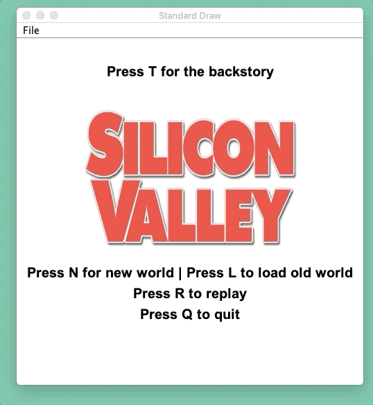

# SilliconValley
This is a [GIPHY](https://itunes.apple.com/us/app/giphy-capture-the-gif-maker/id668208984?mt=12) demo of a game built for Data Structures at Berkeley, taught by Josh Hug. I'm not allowed to post the code here for academic honesty reasons, so feel free to e-mail me for it if you're not a Berkeley student. 

This game is based on HBO's [Silicon Valley](https://www.hbo.com/silicon-valley), a wonderful show I enjoy.

# World Generation
Upon entering the game, the user is prompted to enter a seed, and the code generates a deterministic, randomly generated world for gameplay to happen. These tiles are rendered using a tile-renderer that was provided to us by course staff, based on and augmented with the [Princeton StdDraw](https://introcs.cs.princeton.edu/java/stdlib/javadoc/StdDraw.html) library. Everything from the number, size, arrangement, and layout of tiles, all the way to the music and theme, are based on the seed the user entered.

# Game Interface
The user moves around with their W, A, S and D keys. We wrote the functionality to continuously be able to navigate and read keyboard input without interruptions, as well as displaying tile descriptions when a user mouses over some area of the screen. Simultaneously handling keyboard and mouse input without making use of computer time was a challenge.

